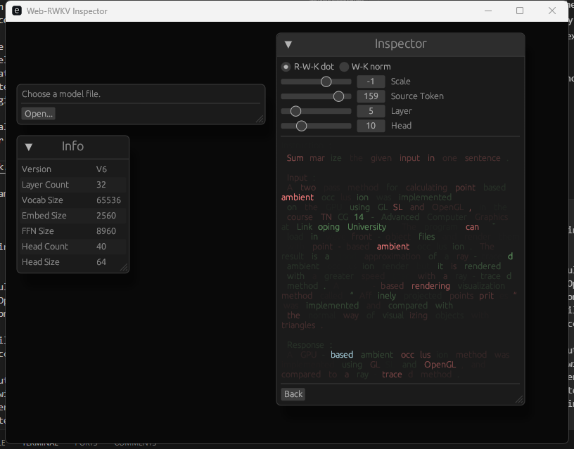

# Web-RWKV Inspector

This is an inspector for the language model of [RWKV X060](https://github.com/BlinkDL/RWKV-LM). It lets you look into the inner state of the model during inference.

## Download

Download pre-built binaries at [Release](https://github.com/cryscan/web-rwkv-inspector/releases).

## Introduction



This is a screenshot of inspecting into a [3B RWKV model](https://huggingface.co/BlinkDL/rwkv-6-world/blob/main/RWKV-x060-World-3B-v2.1-20240417-ctx4096.pth).
The inspector computes the attention score (`QK` dot product for transformers and `R-WK` dot product for `RWKV`) between two tokens `i` and `j` (`i` is less than `j`), for each head for each layer.
The formula of the `R-WK` score is:

.

The blue token is the token that is selected, and for each token before and after it, we compute an attention score between the selected and that token.
Red ones have a positive score; green ones have a negative score.

In this picture, we can see that the head `L5 H10` has some kind of *retrieval behavior*: note that the selected token ("based") is part of a summary of the above text, and this head attends to the selected token to its follower ("ambient") in the source text, which indicated that this head is looking for possible next-word in the given text above.

Also there is another visualization mode, namely `WK` norm, which is essentially a head's influence span for a certain token:

.

The prompt used in this example is:

```text
Instruction:
Summarize the given input in one sentence.

Input:
A two pass method for calculating point based ambient occlusion was implemented
on the GPU using GLSL and OpenGL, in the
course TNCG14 - Advanced Computer Graphics at Linkoping University. The program can ¨
load in wavefront-object files and render them
with point-based ambient occlusion. The result is a good approximation of a ray-traced
ambient occlusion render but it is rendered
with a greater speed than with a ray-traced
method. A point-based rendering visualization method called ”Affinely projected pointsprites” was implemented and compared with
the normal way of visualizing objects with triangles.

Response:
A GPU-based ambient occlusion method was implemented using GLSL and OpenGL, and compared to a ray-traced method.
```
